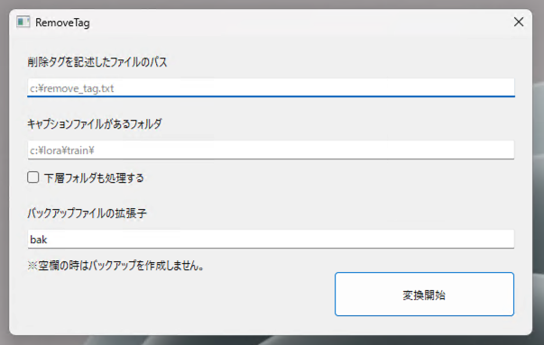

# Remove Tag

StableDiffusionのLoRA学習する際に、キャプションから任意のタグを一括削除するツール。

- Windows用です
- Python + PySide6 で作りました
- 動作確認はあんまりやってません


## Update

- 2023.11.2 / ver 1.1.0
  - バックアップファイルが存在している時にバックアップファイルを作成するとエラーになるのを修正
  - CUI用の `src/removeTag.py` を作成
- 2023.11.1 / ver 1.0.0
  - とりあえず作った


## 開発動機
- キャプションファイルからタグを削除するのは[Dataset Tag Editor](https://github.com/toshiaki1729/stable-diffusion-webui-dataset-tag-editor)でできる
- しかしタグをひとつずつ選択するのが面倒くさい
- 何回も試行錯誤していると選択ミスが発生しそう

↓

- 削除するタグをファイルに記述してラクをしよう
- ファイルに保存するから削除する・しないタグを比較しやすい

## 使い方

`removeTag.exe` をダブルクリックすると起動します



1. `削除タグを記述したファイルのパス`にファイルをドロップ
2. `キャプションファイルがあるフォルダ`フォルダをドロップ
3. `変換開始`をクリック

## 仕様

### 削除タグ記述ファイル
ここに記述したタグをキャプションから削除します。
```
shoes
white shoes
footwear
white footwear
```
区切りは`改行`か`カンマ（,）`です。
カンマの前後に空白が入ってもOKです。
```
shoes,white shoes ,footwear , white footwear
```

### キャプションファイル
削除タグのファイルと同じです。
基本的には[WD1.4 Tagger](https://github.com/picobyte/stable-diffusion-webui-wd14-tagger)が生成したファイルを対象としています。
```
uwabaki,1girl,solo,breasts,nipples,nude,sitting,navel,head out of frame,large breasts,long hair,lower body,legs,own hands together,thighs,close-up,blonde hair,v arms,stomach,bound wrists
```